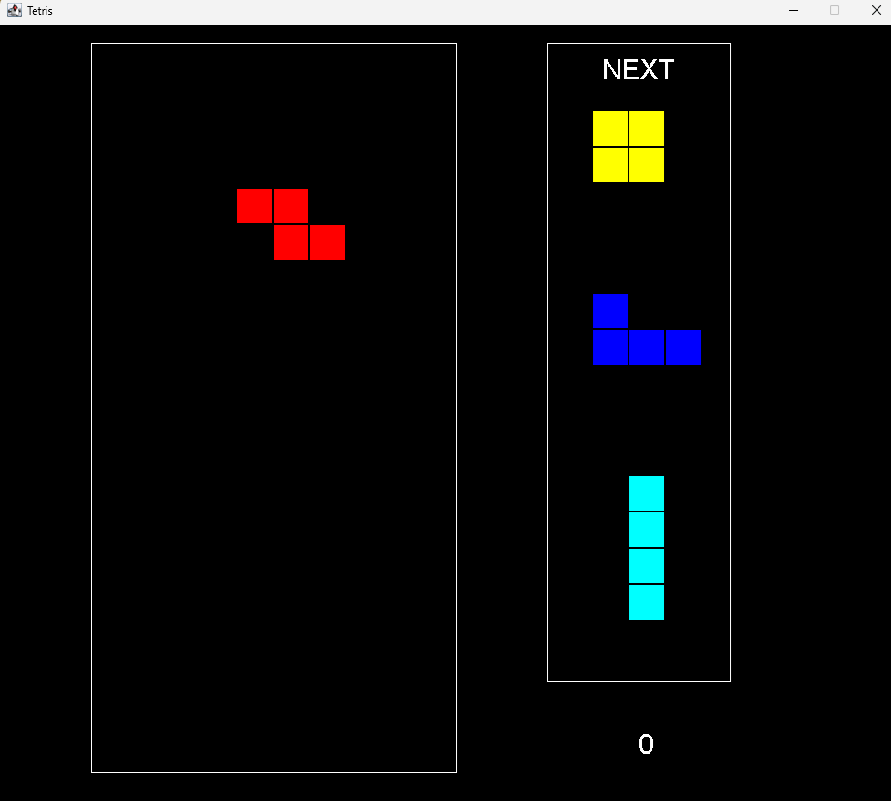
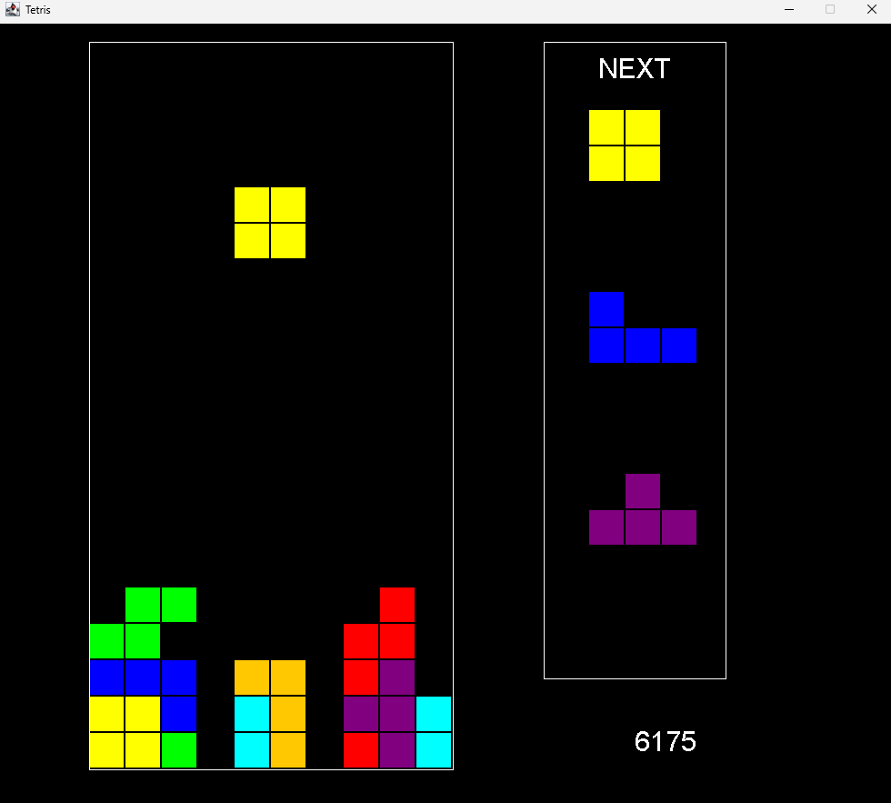

# Tetris

A simple implementation of the video game "Tetris", made for a university project.\
Run the main file with any Java compiler to play.

Missing features:
- Main menu
- Proper score calculation
